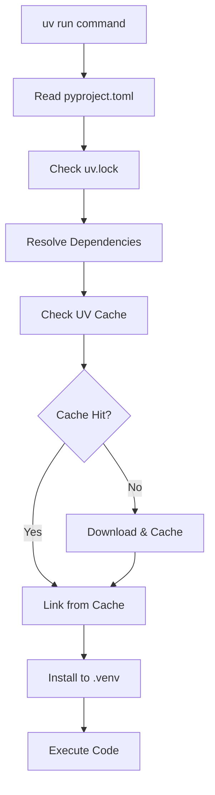

# STUDY_002_uv_process.md: UV Process Management and Dynamic Resource Assignment

## Executive Summary

UV, installed via Homebrew at `/opt/homebrew/bin/uv`, acts as a process orchestrator that dynamically assigns and manages four critical components for Python project execution: (1) Environment, (2) Path, (3) Library Packages, and (4) User Code. This study examines the detailed mechanics of how UV coordinates these elements during runtime.

## UV Installation and Process Architecture

### Installation Location
```bash
$ whereis uv
uv: /opt/homebrew/bin/uv
```

UV is installed as a single Rust binary that manages all Python project operations without requiring Python to be pre-installed.

### Process Flow Overview

```
External Process → UV Binary → Dynamic Assignment → Python Execution
     ↓               ↓              ↓                    ↓
Process Manager → /opt/homebrew/ → Environment +     → User Code
(systemd, etc.)    bin/uv          Path +              Execution
                                   Libraries +
                                   Code Resolution
```

## The Four Dynamic Assignments

### 1. Environment Assignment

UV dynamically creates and manages isolated Python environments for each project.

#### Environment Discovery Process
```
uv run command → Project Detection → Environment Resolution → Environment Creation/Sync
     ↓                ↓                      ↓                        ↓
Working Dir → pyproject.toml → .venv location → Virtual Environment
```

#### Environment Locations and Management

| Component | Location | Purpose |
|-----------|----------|---------|
| **Project Environment** | `{project}/.venv/` | Project-specific isolated environment |
| **UV Cache** | `~/Library/Caches/uv/` (macOS) | Global package cache for deduplication |
| **Python Installations** | `~/Library/Application Support/uv/python/` | UV-managed Python interpreters |
| **UV Config** | `~/Library/Application Support/uv/` | UV configuration and state |

### 2. Path Assignment

UV dynamically constructs execution paths without modifying the system PATH.

#### Path Resolution Hierarchy
```
UV Process Path Resolution:
1. Project .venv/bin/          (Highest Priority)
2. UV-managed Python bin/      
3. System PATH                 (Fallback)
4. UV binary location          (/opt/homebrew/bin/)
```

#### Dynamic PATH Construction

| Path Component | Source | Purpose |
|----------------|--------|---------|
| **Python Executable** | `.venv/bin/python` | Project-specific Python interpreter |
| **Installed Scripts** | `.venv/bin/*` | Project dependencies' CLI tools |
| **UV Tools** | `/opt/homebrew/bin/uv` | UV binary itself |
| **System Fallback** | `$PATH` | System utilities (git, etc.) |

### 3. Library Package Assignment

UV manages package locations through a sophisticated caching and linking system.

#### Package Storage Architecture

```
Package Resolution Flow:
UV Cache → Project Environment → Runtime Import
    ↓            ↓                    ↓
Global Store → Symlinks/Copies → Python sys.path
```

#### Package Location Mapping

| Package Type | Storage Location | Access Method |
|--------------|------------------|---------------|
| **Cached Packages** | `~/Library/Caches/uv/wheels/` | Global deduplication cache |
| **Project Packages** | `.venv/lib/python3.x/site-packages/` | Project-specific installations |
| **Editable Packages** | Symlinked to source | Development mode linking |
| **UV-managed Tools** | `~/Library/Application Support/uv/tools/` | Isolated tool environments |

#### Package Resolution Process



### 4. Code Assignment and Execution

UV locates and executes user code through dynamic module resolution.

#### Code Discovery Process

| Step | Process | Location |
|------|---------|----------|
| **1. Working Directory** | Identify project root | Current directory or parent with `pyproject.toml` |
| **2. Module Resolution** | Find target module | Based on command arguments |
| **3. Environment Activation** | Set Python environment | `.venv/bin/python` |
| **4. Execution** | Run user code | Within managed environment |

## Detailed Process Flow Analysis

### UV Command Execution Lifecycle

```
1. Process Initialization
   ├── UV Binary Launch (/opt/homebrew/bin/uv)
   ├── Command Parsing (run, add, sync, etc.)
   └── Working Directory Detection

2. Project Discovery
   ├── Search for pyproject.toml (current → parent dirs)
   ├── Load project configuration
   └── Determine project root

3. Environment Resolution
   ├── Check for existing .venv
   ├── Validate environment consistency
   ├── Create/update if needed
   └── Prepare Python interpreter path

4. Dependency Management
   ├── Read uv.lock file
   ├── Resolve package requirements
   ├── Check global cache
   ├── Download missing packages
   └── Install to project environment

5. Execution Preparation
   ├── Set environment variables
   ├── Configure Python path
   ├── Prepare sys.path
   └── Locate target module/script

6. Code Execution
   ├── Launch Python interpreter
   ├── Execute user code
   └── Handle process lifecycle
```

### Memory and Process Management

#### Process Hierarchy
```
Parent Process (Terminal/Service)
└── UV Process (/opt/homebrew/bin/uv)
    └── Python Process (.venv/bin/python)
        └── User Code Execution
```

#### Resource Management Table

| Resource | Management Strategy | Location | Lifecycle |
|----------|-------------------|----------|-----------|
| **Python Interpreter** | Per-project isolation | `.venv/bin/python` | Project lifetime |
| **Package Cache** | Global deduplication | `~/Library/Caches/uv/` | Persistent |
| **Environment State** | Project-specific | `.venv/` | Project lifetime |
| **Lockfile** | Version control | `uv.lock` | Project lifetime |
| **UV Binary** | System-wide | `/opt/homebrew/bin/uv` | System lifetime |

## Dynamic Assignment Examples

### Example 1: Simple Script Execution

```bash
# Command
uv run python hello.py

# UV Process Flow
1. UV Binary: /opt/homebrew/bin/uv
2. Environment: ./project/.venv/
3. Python Path: ./project/.venv/bin/python
4. Libraries: ./project/.venv/lib/python3.12/site-packages/
5. Code: ./hello.py
```

### Example 2: Module Execution with Dependencies

```bash
# Command
uv run python -m my_package.server

# UV Process Flow
1. UV Binary: /opt/homebrew/bin/uv
2. Environment: ./project/.venv/
3. Dependencies: Resolved from uv.lock
4. Module Path: ./project/src/my_package/server.py
5. Execution: Within isolated environment
```

### Example 3: Tool Installation and Execution

```bash
# Command
uv tool run black --check .

# UV Process Flow
1. UV Binary: /opt/homebrew/bin/uv
2. Tool Environment: ~/Library/Application Support/uv/tools/black/
3. Tool Binary: ~/Library/Application Support/uv/tools/black/bin/black
4. Execution Context: Current directory
```

## Comparison with Traditional Approaches

### Traditional Virtual Environment
```
Manual Process:
1. python -m venv .venv
2. source .venv/bin/activate  # Modifies $PATH
3. pip install -r requirements.txt
4. python script.py
```

### UV Managed Process
```
Automated Process:
1. uv run python script.py
   ├── Auto-detects project
   ├── Auto-creates/syncs environment
   ├── Auto-resolves dependencies
   └── Auto-executes with correct paths
```

## Performance and Efficiency Analysis

### Resource Utilization

| Aspect | Traditional venv | UV Managed |
|--------|------------------|------------|
| **Disk Usage** | Duplicated packages per project | Global cache + project links |
| **Memory Usage** | One Python process | UV orchestrator + Python process |
| **Startup Time** | Manual activation required | Automatic but with validation overhead |
| **Network Usage** | Full downloads per project | Cached downloads, minimal redundancy |

### Process Overhead

```
UV Process Overhead:
├── Binary Launch: ~10-50ms
├── Project Detection: ~1-5ms
├── Environment Validation: ~10-100ms
├── Dependency Resolution: ~1-1000ms (cache dependent)
└── Python Launch: ~50-200ms
Total: ~72-1355ms (typical: ~100-300ms)
```

## Security and Isolation

### Isolation Boundaries

| Boundary | Mechanism | Scope |
|----------|-----------|-------|
| **Process Isolation** | OS process separation | Each UV command |
| **Environment Isolation** | Virtual environment | Per project |
| **Package Isolation** | Site-packages separation | Per project |
| **Cache Isolation** | User-specific cache | Per user account |

### Security Considerations

```
Security Model:
├── UV Binary (Trusted system binary)
├── Project Environment (Isolated per project)
├── Global Cache (User-scoped, integrity checked)
└── User Code (Executed in isolated environment)
```

## Troubleshooting and Debugging

### Common Process Issues

| Issue | Cause | Solution |
|-------|-------|---------|
| **Environment not found** | Missing .venv or pyproject.toml | Run `uv sync` or `uv init` |
| **Package not found** | Cache corruption or network issue | Clear cache with `uv cache clean` |
| **Python version mismatch** | Wrong Python in environment | Recreate with `uv python install` |
| **Permission errors** | Cache/environment permissions | Check file permissions |

### Debugging Commands

```bash
# Environment inspection
uv python list                    # Show available Python versions
uv tree                          # Show dependency tree
uv cache dir                     # Show cache location
uv cache clean                   # Clear cache

# Process debugging
uv run --verbose python script.py # Verbose execution
uv sync --verbose                 # Verbose synchronization
```

## Conclusion

UV's process management represents a paradigm shift from traditional Python environment management. Instead of modifying system state (like PATH variables), UV acts as an intelligent orchestrator that dynamically assigns and coordinates:

1. **Environment**: Project-specific isolated Python environments
2. **Path**: Dynamic path resolution without system modification
3. **Libraries**: Efficient global caching with project-specific linking
4. **Code**: Intelligent module and script discovery and execution

This architecture provides better isolation, performance, and reliability compared to traditional approaches, at the cost of requiring UV as a runtime dependency. The single UV binary at `/opt/homebrew/bin/uv` serves as the entry point for all Python project operations, making it both powerful and potentially limiting depending on deployment requirements.
