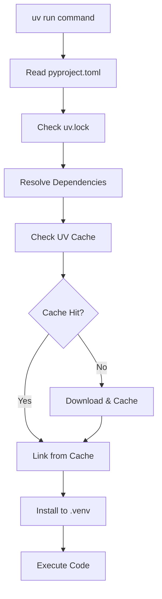

# STUDY_002_uv_process.md: UV Process Management and Dynamic Resource Assignment

## Executive Summary

UV, installed via Homebrew at `/opt/homebrew/bin/uv`, acts as a process orchestrator that dynamically assigns and manages four critical components for Python project execution: (1) Environment, (2) Path, (3) Library Packages, and (4) User Code. This study examines the detailed mechanics of how UV coordinates these elements during runtime.

## UV Installation and Process Architecture

### Installation Location
```bash
$ whereis uv
uv: /opt/homebrew/bin/uv
```

UV is installed as a single Rust binary that manages all Python project operations without requiring Python to be pre-installed.

### Process Flow Overview

```
External Process → UV Binary → Dynamic Assignment → Python Execution
     ↓               ↓              ↓                    ↓
Process Manager → /opt/homebrew/ → Environment +     → User Code
(systemd, etc.)    bin/uv          Path +              Execution
                                   Libraries +
                                   Code Resolution
```

## The Four Dynamic Assignments

### 1. Environment Assignment

UV dynamically creates and manages isolated Python environments for each project.

#### Environment Discovery Process
```
uv run command → Project Detection → Environment Resolution → Environment Creation/Sync
     ↓                ↓                      ↓                        ↓
Working Dir → pyproject.toml → .venv location → Virtual Environment
```

## UV's Automatic Detection System

### What Does "Automatic Detection" Mean?

UV's automatic detection refers to systematic search algorithms that locate project files, configurations, and environments without explicit user specification. This follows predictable search orders and priorities.

### 1. Project Root Detection Algorithm

UV uses a hierarchical search pattern to find the project root:

#### Search Order (Priority: High → Low)

| Priority | Search Location | Target File | Action if Found |
|----------|----------------|-------------|-----------------|
| **1** | Current working directory | `pyproject.toml` | Use as project root |
| **2** | Parent directory | `pyproject.toml` | Use parent as project root |
| **3** | Grandparent directory | `pyproject.toml` | Use grandparent as project root |
| **4** | Continue up to filesystem root | `pyproject.toml` | Use first match as project root |
| **5** | No `pyproject.toml` found | N/A | Error or create new project |

#### Detailed Search Algorithm

```bash
# UV's project detection logic (pseudocode)
function find_project_root(current_dir):
    search_dir = current_dir
    while search_dir != filesystem_root:
        if exists(search_dir + "/pyproject.toml"):
            return search_dir
        search_dir = parent_directory(search_dir)
    return None  # No project found
```

#### Real-World Example

```bash
# Directory structure
/home/user/projects/my-app/
├── pyproject.toml          # ← Project root
├── src/
│   └── my_package/
│       └── server.py
└── tests/
    └── test_server.py

# From any subdirectory, UV finds the project root
$ cd /home/user/projects/my-app/src/my_package/
$ uv run python server.py
# UV searches:
# 1. /home/user/projects/my-app/src/my_package/ → No pyproject.toml
# 2. /home/user/projects/my-app/src/ → No pyproject.toml  
# 3. /home/user/projects/my-app/ → Found pyproject.toml ✓
# Project root: /home/user/projects/my-app/
```

### 2. Environment Detection Algorithm

Once project root is found, UV searches for existing environments:

#### Environment Search Priority

| Priority | Location | Pattern | Purpose |
|----------|----------|---------|---------|
| **1** | `{project_root}/.venv/` | Exact match | Project-local environment |
| **2** | `{project_root}/venv/` | Alternative name | Common alternative |
| **3** | Environment variable `VIRTUAL_ENV` | If set and valid | Explicit override |
| **4** | UV-managed environments | `~/.cache/uv/environments/` | UV-created environments |
| **5** | Create new | `{project_root}/.venv/` | Default creation location |

#### Environment Validation Process

```bash
# UV's environment validation (pseudocode)
function validate_environment(env_path):
    checks = [
        exists(env_path + "/bin/python"),           # Python executable
        exists(env_path + "/lib/python*/site-packages/"), # Package directory
        compatible_python_version(env_path),        # Version compatibility
        valid_environment_structure(env_path)       # Standard venv structure
    ]
    return all(checks)
```

### 3. Configuration Detection Hierarchy

UV searches for configuration in multiple locations with specific precedence:

#### Configuration Search Order

| Priority | Location | Scope | Override Behavior |
|----------|----------|-------|-------------------|
| **1** | `{project_root}/pyproject.toml` | Project-specific | Highest priority |
| **2** | `{project_root}/uv.toml` | UV-specific project config | Overrides global |
| **3** | `~/.config/uv/uv.toml` | User-global config | Default settings |
| **4** | Environment variables | Runtime overrides | `UV_*` variables |
| **5** | Command-line flags | Explicit overrides | Highest precedence |

#### Configuration Merge Strategy

```bash
# Configuration precedence (highest to lowest)
Command Line Flags
    ↓ (overrides)
Environment Variables (UV_*)
    ↓ (overrides)  
Project pyproject.toml [tool.uv]
    ↓ (overrides)
Project uv.toml
    ↓ (overrides)
User ~/.config/uv/uv.toml
    ↓ (defaults)
Built-in defaults
```

### 4. Python Interpreter Detection

UV follows a systematic approach to find the appropriate Python interpreter:

#### Python Search Algorithm

| Priority | Source | Location Pattern | Validation |
|----------|--------|------------------|------------|
| **1** | Project specification | `pyproject.toml` `requires-python` | Version compatibility |
| **2** | Existing environment | `.venv/bin/python` | If environment exists |
| **3** | UV-managed Python | `~/.cache/uv/python/cpython-*` | UV-installed versions |
| **4** | System PATH | `python3`, `python` | Version check |
| **5** | Common locations | `/usr/bin/python3`, `/usr/local/bin/python3` | Fallback search |

#### Python Version Resolution

```bash
# UV's Python resolution logic
function resolve_python_version(project_requirements):
    # 1. Check project requirements
    required_version = parse_requires_python(pyproject.toml)
    
    # 2. Find compatible interpreters
    candidates = find_python_interpreters()
    compatible = filter_by_version(candidates, required_version)
    
    # 3. Prefer UV-managed over system
    uv_managed = filter_uv_managed(compatible)
    if uv_managed:
        return highest_version(uv_managed)
    
    # 4. Use system Python if compatible
    return highest_version(compatible)
```

### 5. Dependency Detection and Resolution

UV's dependency detection follows a cascading priority system:

#### Dependency Source Priority

| Priority | Source File | Section | Purpose |
|----------|-------------|---------|---------|
| **1** | `uv.lock` | All dependencies | Exact versions (if exists) |
| **2** | `pyproject.toml` | `[project.dependencies]` | Core dependencies |
| **3** | `pyproject.toml` | `[project.optional-dependencies]` | Optional/extra dependencies |
| **4** | `pyproject.toml` | `[dependency-groups]` | Development dependencies |
| **5** | `requirements.txt` | All lines | Legacy format (if no pyproject.toml) |

### 6. Predictable Behavior Patterns

#### Systematic Expectations

You can systematically expect UV's behavior based on these patterns:

```bash
# Pattern 1: Project Detection
# UV always searches upward from current directory
$ cd /any/subdirectory/in/project/
$ uv run script.py  # Will find project root above

# Pattern 2: Environment Preference  
# UV prefers .venv in project root over global environments
$ ls project_root/
.venv/  pyproject.toml
$ uv run script.py  # Uses ./venv, not global

# Pattern 3: Configuration Cascade
# More specific configs override general ones
$ uv run --python 3.11 script.py  # CLI flag overrides all configs

# Pattern 4: Cache-First Strategy
# UV checks cache before downloading
$ uv add requests  # Checks ~/.cache/uv/ first
```

#### Error Conditions and Fallbacks

| Condition | UV Behavior | Fallback Action |
|-----------|-------------|-----------------|
| **No pyproject.toml found** | Error message | Suggest `uv init` |
| **Invalid environment** | Recreate environment | Use cached packages |
| **Python version mismatch** | Download compatible Python | Use UV-managed Python |
| **Network unavailable** | Use cached packages | Fail if not cached |
| **Permission denied** | Error with suggestion | Check file permissions |

### 7. Debugging Detection Process

You can trace UV's detection process:

```bash
# Enable verbose output to see detection steps
uv run --verbose python script.py

# Check what UV detects
uv python list          # Available Python versions
uv tree                # Dependency tree
uv show --project      # Project information
```

This systematic approach ensures UV's behavior is predictable and debuggable, following clear hierarchies and search patterns rather than arbitrary detection logic.

#### Environment Locations and Management

| Component | Location | Purpose |
|-----------|----------|---------|
| **Project Environment** | `{project}/.venv/` | Project-specific isolated environment |
| **UV Cache** | `~/.cache/uv/` (actual location) | Global package cache for deduplication |
| **Python Installations** | `~/.cache/uv/python/` | UV-managed Python interpreters |
| **UV Config** | `~/.config/uv/` or `~/Library/Preferences/uv/` | UV configuration and state |

#### UV's Actual Directory Structure

Based on real system verification, UV uses different directory conventions than initially documented:

**Actual UV Cache Location**: `~/.cache/uv/` (follows XDG Base Directory specification)

```bash
# Verified UV cache directory
$ uv cache dir
/Users/sparkt/.cache/uv
```

#### Platform-Specific UV Data Locations (Corrected)

| Platform | UV Cache Directory | Python Installations | Configuration |
|----------|------------------|---------------------|---------------|
| **macOS** | `~/.cache/uv/` | `~/.cache/uv/python/` | `~/.config/uv/` or `~/Library/Preferences/uv/` |
| **Linux** | `~/.cache/uv/` or `$XDG_CACHE_HOME/uv/` | `~/.cache/uv/python/` | `~/.config/uv/` or `$XDG_CONFIG_HOME/uv/` |
| **Windows** | `%LOCALAPPDATA%\uv\cache\` | `%LOCALAPPDATA%\uv\python\` | `%APPDATA%\uv\` |

#### Why UV Uses XDG Base Directory Specification

UV follows the XDG Base Directory Specification rather than macOS-specific Application Support:

```
XDG Directory Benefits:
├── Cross-platform consistency
├── User-specific (not system-wide)  
├── Separates cache from config
├── Follows modern Unix conventions
└── Respects XDG environment variables
```

#### Verifying UV Directories

You can check UV's actual directory usage:
```bash
# Show UV's cache directory
uv cache dir

# List UV cache contents (if exists)
ls -la ~/.cache/uv/

# Check for UV configuration directory
ls -la ~/.config/uv/ 2>/dev/null || echo "Config directory not yet created"

# Show all UV-related directories
find ~ -name "*uv*" -type d 2>/dev/null | grep -E "(cache|config|local)"
```

#### Directory Creation Timing

UV directories are created on-demand:
- **Cache directory**: Created on first package download/install
- **Config directory**: Created when configuration is first saved
- **Python directory**: Created when UV installs/manages Python versions

### 2. Path Assignment

UV dynamically constructs execution paths without modifying the system PATH.

#### Path Resolution Hierarchy
```
UV Process Path Resolution:
1. Project .venv/bin/          (Highest Priority)
2. UV-managed Python bin/      
3. System PATH                 (Fallback)
4. UV binary location          (/opt/homebrew/bin/)
```

#### Dynamic PATH Construction

| Path Component | Source | Purpose |
|----------------|--------|---------|
| **Python Executable** | `.venv/bin/python` | Project-specific Python interpreter |
| **Installed Scripts** | `.venv/bin/*` | Project dependencies' CLI tools |
| **UV Tools** | `/opt/homebrew/bin/uv` | UV binary itself |
| **System Fallback** | `$PATH` | System utilities (git, etc.) |

### 3. Library Package Assignment

UV manages package locations through a sophisticated caching and linking system.

#### Package Storage Architecture

```
Package Resolution Flow:
UV Cache → Project Environment → Runtime Import
    ↓            ↓                    ↓
Global Store → Symlinks/Copies → Python sys.path
```

#### Package Location Mapping

| Package Type | Storage Location | Access Method |
|--------------|------------------|---------------|
| **Cached Packages** | `~/.cache/uv/wheels/` | Global deduplication cache |
| **Project Packages** | `.venv/lib/python3.x/site-packages/` | Project-specific installations |
| **Editable Packages** | Symlinked to source | Development mode linking |
| **UV-managed Tools** | `~/.cache/uv/tools/` | Isolated tool environments |

#### Package Resolution Process



### 4. Code Assignment and Execution

UV locates and executes user code through dynamic module resolution.

#### Code Discovery Process

| Step | Process | Location |
|------|---------|----------|
| **1. Working Directory** | Identify project root | Current directory or parent with `pyproject.toml` |
| **2. Module Resolution** | Find target module | Based on command arguments |
| **3. Environment Activation** | Set Python environment | `.venv/bin/python` |
| **4. Execution** | Run user code | Within managed environment |

## Detailed Process Flow Analysis

### UV Command Execution Lifecycle

```
1. Process Initialization
   ├── UV Binary Launch (/opt/homebrew/bin/uv)
   ├── Command Parsing (run, add, sync, etc.)
   └── Working Directory Detection

2. Project Discovery
   ├── Search for pyproject.toml (current → parent dirs)
   ├── Load project configuration
   └── Determine project root

3. Environment Resolution
   ├── Check for existing .venv
   ├── Validate environment consistency
   ├── Create/update if needed
   └── Prepare Python interpreter path

4. Dependency Management
   ├── Read uv.lock file
   ├── Resolve package requirements
   ├── Check global cache
   ├── Download missing packages
   └── Install to project environment

5. Execution Preparation
   ├── Set environment variables
   ├── Configure Python path
   ├── Prepare sys.path
   └── Locate target module/script

6. Code Execution
   ├── Launch Python interpreter
   ├── Execute user code
   └── Handle process lifecycle
```

### Memory and Process Management

#### Process Hierarchy
```
Parent Process (Terminal/Service)
└── UV Process (/opt/homebrew/bin/uv)
    └── Python Process (.venv/bin/python)
        └── User Code Execution
```

#### Resource Management Table

| Resource | Management Strategy | Location | Lifecycle |
|----------|-------------------|----------|-----------|
| **Python Interpreter** | Per-project isolation | `.venv/bin/python` | Project lifetime |
| **Package Cache** | Global deduplication | `~/Library/Caches/uv/` | Persistent |
| **Environment State** | Project-specific | `.venv/` | Project lifetime |
| **Lockfile** | Version control | `uv.lock` | Project lifetime |
| **UV Binary** | System-wide | `/opt/homebrew/bin/uv` | System lifetime |

## Dynamic Assignment Examples

### Example 1: Simple Script Execution

```bash
# Command
uv run python hello.py

# UV Process Flow
1. UV Binary: /opt/homebrew/bin/uv
2. Environment: ./project/.venv/
3. Python Path: ./project/.venv/bin/python
4. Libraries: ./project/.venv/lib/python3.12/site-packages/
5. Code: ./hello.py
```

### Example 2: Module Execution with Dependencies

```bash
# Command
uv run python -m my_package.server

# UV Process Flow
1. UV Binary: /opt/homebrew/bin/uv
2. Environment: ./project/.venv/
3. Dependencies: Resolved from uv.lock
4. Module Path: ./project/src/my_package/server.py
5. Execution: Within isolated environment
```

### Example 3: Tool Installation and Execution

```bash
# Command
uv tool run black --check .

# UV Process Flow
1. UV Binary: /opt/homebrew/bin/uv
2. Tool Environment: ~/Library/Application Support/uv/tools/black/
3. Tool Binary: ~/Library/Application Support/uv/tools/black/bin/black
4. Execution Context: Current directory
```

## Comparison with Traditional Approaches

### Traditional Virtual Environment
```
Manual Process:
1. python -m venv .venv
2. source .venv/bin/activate  # Modifies $PATH
3. pip install -r requirements.txt
4. python script.py
```

### UV Managed Process
```
Automated Process:
1. uv run python script.py
   ├── Auto-detects project
   ├── Auto-creates/syncs environment
   ├── Auto-resolves dependencies
   └── Auto-executes with correct paths
```

## Performance and Efficiency Analysis

### Resource Utilization

| Aspect | Traditional venv | UV Managed |
|--------|------------------|------------|
| **Disk Usage** | Duplicated packages per project | Global cache + project links |
| **Memory Usage** | One Python process | UV orchestrator + Python process |
| **Startup Time** | Manual activation required | Automatic but with validation overhead |
| **Network Usage** | Full downloads per project | Cached downloads, minimal redundancy |

### Process Overhead

```
UV Process Overhead:
├── Binary Launch: ~10-50ms
├── Project Detection: ~1-5ms
├── Environment Validation: ~10-100ms
├── Dependency Resolution: ~1-1000ms (cache dependent)
└── Python Launch: ~50-200ms
Total: ~72-1355ms (typical: ~100-300ms)
```

## Security and Isolation

### Isolation Boundaries

| Boundary | Mechanism | Scope |
|----------|-----------|-------|
| **Process Isolation** | OS process separation | Each UV command |
| **Environment Isolation** | Virtual environment | Per project |
| **Package Isolation** | Site-packages separation | Per project |
| **Cache Isolation** | User-specific cache | Per user account |

### Security Considerations

```
Security Model:
├── UV Binary (Trusted system binary)
├── Project Environment (Isolated per project)
├── Global Cache (User-scoped, integrity checked)
└── User Code (Executed in isolated environment)
```

## Troubleshooting and Debugging

### Common Process Issues

| Issue | Cause | Solution |
|-------|-------|---------|
| **Environment not found** | Missing .venv or pyproject.toml | Run `uv sync` or `uv init` |
| **Package not found** | Cache corruption or network issue | Clear cache with `uv cache clean` |
| **Python version mismatch** | Wrong Python in environment | Recreate with `uv python install` |
| **Permission errors** | Cache/environment permissions | Check file permissions |

### Debugging Commands

```bash
# Environment inspection
uv python list                    # Show available Python versions
uv tree                          # Show dependency tree
uv cache dir                     # Show cache location
uv cache clean                   # Clear cache

# Process debugging
uv run --verbose python script.py # Verbose execution
uv sync --verbose                 # Verbose synchronization
```

## Conclusion

UV's process management represents a paradigm shift from traditional Python environment management. Instead of modifying system state (like PATH variables), UV acts as an intelligent orchestrator that dynamically assigns and coordinates:

1. **Environment**: Project-specific isolated Python environments
2. **Path**: Dynamic path resolution without system modification
3. **Libraries**: Efficient global caching with project-specific linking
4. **Code**: Intelligent module and script discovery and execution

This architecture provides better isolation, performance, and reliability compared to traditional approaches, at the cost of requiring UV as a runtime dependency. The single UV binary at `/opt/homebrew/bin/uv` serves as the entry point for all Python project operations, making it both powerful and potentially limiting depending on deployment requirements.
